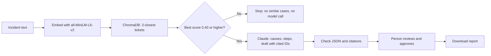

# Procurement Support Assistant

A retrieval-augmented (RAG) assistant for blocked supplier invoices. You describe a problem, it finds similar past tickets, Claude suggests likely causes and fix steps with the source tickets cited, and a person reviews and approves a draft report.

All data in this project is **synthetic** (made up). It demonstrates a pattern and has no real users.

## Try it in 60 seconds

1. Open the live app above.
2. Paste your own Anthropic API key into the sidebar. It is used for your session only and is never stored.
3. Type one of these and click **Find similar cases**:

| Type this | You should see |
|---|---|
| `invoice from supplier is blocked, price is 8 percent higher than the purchase order` | Similar tickets, causes citing TKT-001 and TKT-003, fix steps, an editable draft and an Approve button |
| `the cafeteria coffee machine is broken` | "Closest tickets, none relevant". No model call is made |
| `employee expense report rejected for missing receipt` | "No applicable past cases". Claude declines because the tickets cover supplier invoices, not employee expenses |

The first search can take a minute while the server loads the search model, and the app may need a moment to start if it has been idle. Leaving the key box empty shows a message asking for a key.

## The problem

When a company buys from suppliers, three records should agree before a bill is paid: the purchase order (what was ordered), the goods receipt (what arrived) and the invoice (the supplier's bill). When they do not agree, the invoice is blocked until someone finds out why. Similar problems were usually solved before, but the answers sit in scattered old tickets. This assistant is aimed at the support analyst who has to work out why.

## How it works

1. **Search.** Each of 40 synthetic tickets is turned into an embedding (a list of numbers that stands for its meaning) using ChromaDB's default model, `all-MiniLM-L6-v2`, which runs locally. The incident you type is embedded the same way, and the 3 closest tickets come back with a similarity score.
2. **Cutoff.** If the best score is below 0.40, the app says no similar cases exist and does not call the model.
3. **Answer.** Claude (`claude-sonnet-4-6`) receives the incident and the 3 tickets. It is told to use only those tickets, cite their IDs, and say so if none fit. It replies in JSON with root causes, resolution steps and a draft report.
4. **Checks.** The code strips code fences, validates the JSON, and removes any cited ticket ID that was not among the retrieved tickets. Failures show as errors and are never shown as a clean result.
5. **Approval.** The draft is editable. Nothing can be downloaded until a person clicks Approve, which also locks the text.

## Example output

Abridged, from a local run with the first input above.

> **Root causes**
> 1. The invoice price is above the purchase order price and outside the price tolerance. The supplier may have raised its list price after the order was placed. *Sources: TKT-001*
> 2. A volume discount or pricing condition on the order may no longer match the agreed price. *Sources: TKT-003*
>
> **Resolution steps (abridged)**
> 1. Compare the order and invoice unit prices and confirm the 8% gap.
> 2. Ask the supplier whether a price change was agreed, and get it in writing.
> 3. Check whether any discount on the order still applies, and correct the order line if needed.
> 4. Re-run invoice matching and release the invoice if it is within tolerance.
>
> **Draft report** (editable, then Approve)

## Results

| Check | Result |
|---|---|
| Search test: right ticket in the top 3 | 11 of 12 queries |
| Search test: right ticket ranked first | 7 of 12 queries |
| Look-alike ticket pairs covered by the queries | All 6 (identical symptom, different cause) |
| Best-match scores for unrelated queries | 0.07 to 0.22 |
| Best-match scores for the 12 real queries | 0.50 to 0.74 |
| Expense-report case (near miss, scored 0.57) | Passed the cutoff, then declined by the model |

`retrieval_test.py` runs the queries in `queries.json`, each with the ticket that should come back.

**The one miss.** "We ordered by the carton but they billed per single item" expected TKT-026, whose text says "boxes of 10" and "single piece". The search model did not connect the different words. I tried making that ticket's symptom clearer, it did not help, so I reverted it and kept the miss as a known weakness.

**How much to trust this.** The data is synthetic and the queries were drafted with AI help, so they match the tickets more neatly than real messages would. Twelve queries are a sanity check, not an accuracy figure, and only 12 of the 40 tickets are the target of a query.

## Design decisions

| Decision | Why |
|---|---|
| Retrieve first, then answer
